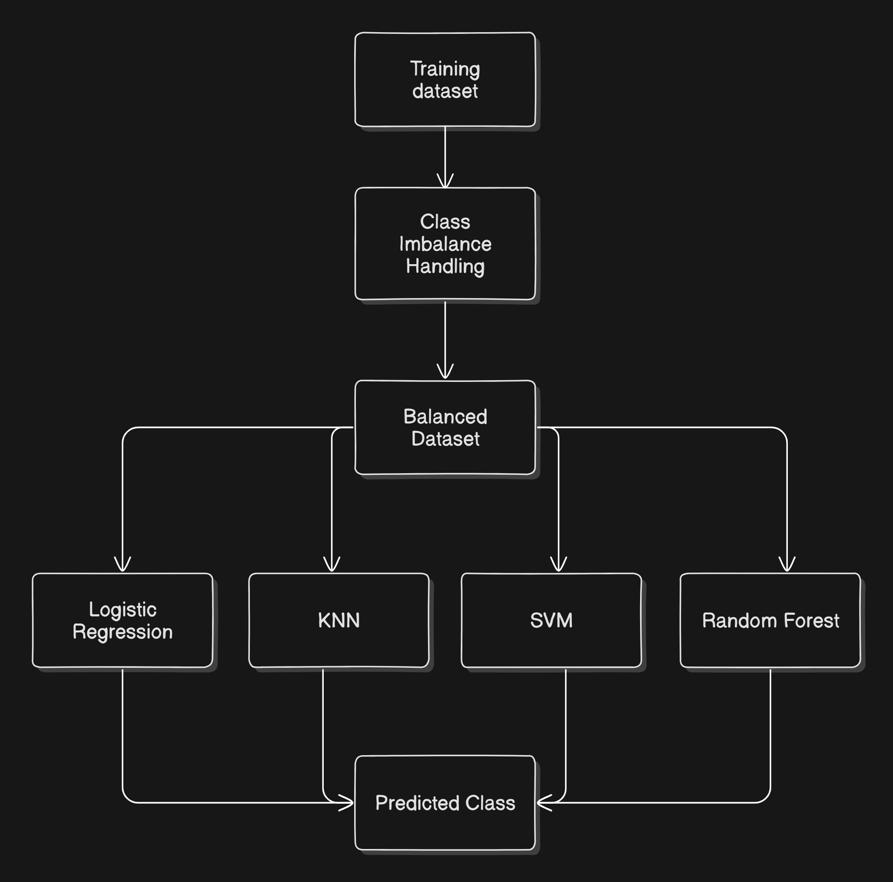
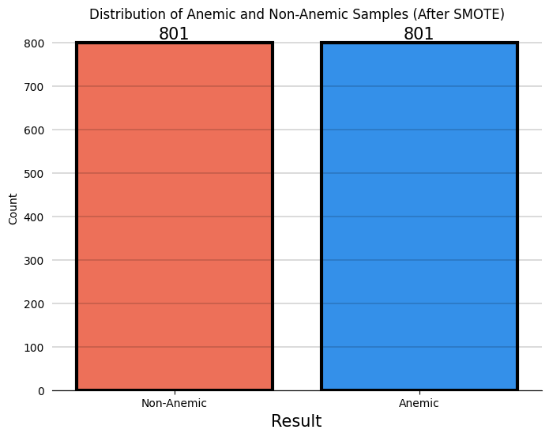
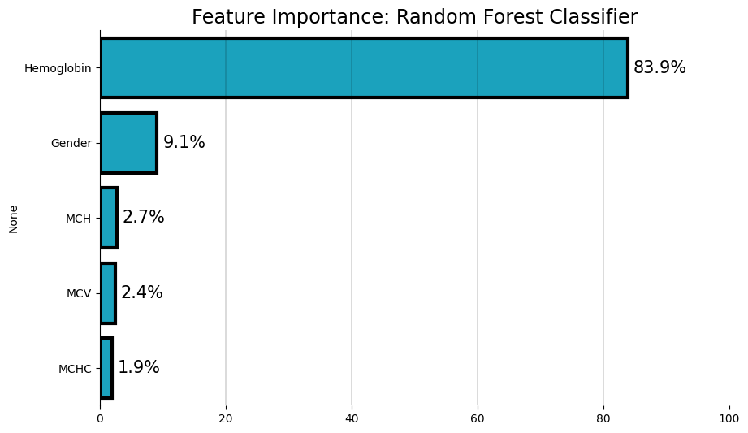

<div align="center">

# 🚑 Anemia Detection Using Machine Learning 🚑

*An intelligent system for predicting anemia using Random Forest Classification*

[](https://www.python.org/downloads/)
[](https://flask.palletsprojects.com/)
[](https://opensource.org/licenses/MIT)


</div>

---

<div align="center">

##  Overview
</div>

This project implements a **Random Forest Classifier** to predict whether an individual is anemic or non-anemic based on their blood-related attributes. The project includes:
- A **Flask-based web application** to interact with the model
- Pre-trained model for predictions
- A detailed implementation of training, class balancing, and feature importance analysis
- **NEW FEATURE**: Upload a **blood report image** to predict anemia using **Google Gemini 2.0 Flash** for text extraction

<div align="center">

##  Features

</div>

1. **Random Forest Classifier** for high accuracy predictions
2. **SMOTE (Synthetic Minority Oversampling Technique)** for handling class imbalance
3. **Feature Importance Analysis** to identify the most significant contributors to predictions
4. Simple **frontend interface** for user input
5. **NEW**: **Image-Based Prediction** – Upload a **blood test report** image to automatically extract relevant values and get predictions

<div align="center">

## 📊 Performance Evaluation

*Model Comparison Analysis*

| Algorithm            | Accuracy | AUC |
|:-------------------:|:--------:|:---:|
| Random Forest       | 99%      | 99% |
| Logistic Regression | 98%      | 98% |
| SVM                 | 90%      | 90% |
| KNN                 | 87%      | 87% |

</div>

*Random Forest Classifier demonstrates superior performance across both metrics.*

<div align="center">

## 🏰 System Architecture



*The system follows a structured pipeline from dataset handling to model predictions.*

## 📊 Dataset Attributes

</div>

- 💉 **Hemoglobin Levels**
- 🔬 **Mean Corpuscular Volume (MCV)**
- 🧪 **Mean Corpuscular Hemoglobin (MCH)**
- 📈 **Mean Corpuscular Hemoglobin Concentration (MCHC)**
- 👤 **Gender**

<div align="center">

## ⚖️ Class Balance Management



*Achieved perfect balance: 801 samples each for anemic and non-anemic classes using SMOTE*

## 🔍 Feature Importance Analysis



</div>

Key Contributors:
- 🟥 **Hemoglobin**: 87.0% contribution
- 👥 **Gender**: 9.1% contribution
- 🧬 **MCH**: 2.7% contribution
- 💉 **Others**: 1.2% contribution

<div align="center">

##  Flask Web Application

</div>

### 🛠️ Application Structure
```bash
Directory structure:
└── yogeshwaran10-anemia_detection/
    ├── README.md
    ├── Procfile
    ├── app.py
    ├── process_image.py
    ├── requirements.txt
    ├── runtime.txt
    ├── utils.py
    ├── images/
    ├── model/
    │   └── random_forest_classifier.pkl
    ├── static/
    │   └── style.css
    └── templates/
        └── index.html
```

<div align="center">

## 💻 Installation & Usage

</div>

### 1️⃣ Clone the Repository
```bash
git clone <repository_url>
cd anemia-detection
```

### 2️⃣ Install Dependencies
```bash
pip install -r requirements.txt
```

### 3️⃣ Run the Application
```bash
python app.py
```

Then open the app in your browser at `http://127.0.0.1:5000/`

<div align="center">

## 📈 Results

</div>

- ✅ **High Accuracy**: Achieved through class balancing and Random Forest optimization
- 🎯 **Precise Predictions**: Driven by significant features like hemoglobin levels
- 📸 **New Image Upload Feature**: Extracts blood test attributes automatically for prediction

<div align="center">

## 🔮 Future Scope

</div>

- 📊 **Expand dataset** to include more diverse features
- 🚀 **Implement advanced models** like XGBoost or LightGBM
- ⚖️ **Address Feature scaling** ⚙️ importance to other features

<div align="center">

## 📸 Screenshots

### 1. System Architecture


### 2. Balanced Dataset After SMOTE


### 3. Feature Importance Analysis


</div>

---

<div align="center">

##  **Live Deployment** ☁️ **Deployed on Render**

You can try the deployed version of the application here 🚀:

[**Anemia Detection App**](https://anemia-detection-46ji.onrender.com)


---

</div>

### **Outcome Variable Explanation:**

The **outcome variable** in the dataset indicates the final diagnosis or classification for each patient. The outcome is binary, with two possible values:

- **Not Anemic**: The patient is not anemic, based on clinical criteria and test results.
- **Anemic**: The patient is anemic, suggesting a deficiency of red blood cells or hemoglobin in the blood.

##  Contributing

Your contributions are welcome! Feel free to:
- 🐛 Report bugs
- 💡 Suggest features
- 🔧 Submit pull requests

## 🐝 License

This project is licensed under the MIT License. See the `LICENSE` file for details.

</div>
